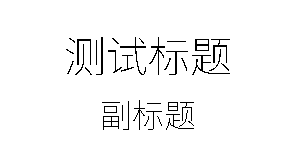
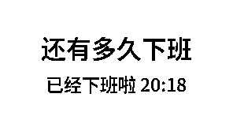
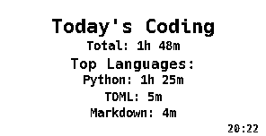
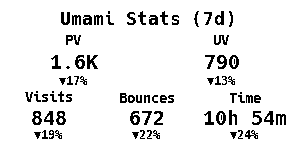
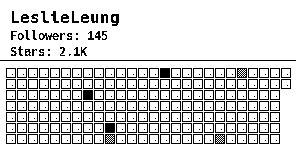
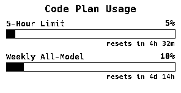

# Dotmate

Dotmate 是一个用于管理[Quote/0](https://dot.mindreset.tech/product/quote)消息推送的调度器，支持通过定时任务向设备发送各种类型的消息。

## 功能特性

- 🕐 **定时任务调度**：基于 Cron 表达式的定时任务系统
- 💬 **多种消息类型**：支持文本消息、工作倒计时、代码状态、图片消息、标题图片生成和 Umami 统计等多种消息类型
- 🎯 **多设备管理**：支持管理多个设备，每个设备可配置独立的任务调度
- 🔧 **灵活配置**：使用 YAML 配置文件管理设备和任务
- 🚀 **即时推送**：支持手动触发消息推送

## 效果展示

### 标题图片


### 工作倒计时


### 代码状态监控


### Umami 统计


### GitHub 贡献图


### 代码计划用量


## 快速开始

### 方式一：Docker Compose（推荐）

1. 克隆项目：
```bash
git clone https://github.com/leslieleung/dotmate
cd dotmate
```

2. 复制配置文件模板：
```bash
cp config.example.yaml config.yaml
```

3. 编辑配置文件 `config.yaml`，填入你的 API 密钥和设备信息。

4. 启动服务：
```bash
# 启动容器
docker-compose up -d

# 查看日志
docker-compose logs -f

# 停止服务
docker-compose down
```

### 方式二：直接使用 Docker

如果你只想快速运行，可以直接使用 Docker 命令：

```bash
# 拉取镜像
docker pull ghcr.io/leslieleung/dotmate:latest

# 运行容器（需要提前准备好 config.yaml）
docker run -d \
  --name dotmate \
  --restart unless-stopped \
  -v $(pwd)/config.yaml:/app/config.yaml:ro \
  -v $(pwd)/logs:/app/logs \
  ghcr.io/leslieleung/dotmate:latest

# 查看日志
docker logs -f dotmate

# 停止容器
docker stop dotmate

# 删除容器
docker rm dotmate
```

### 方式三：本地开发

#### 环境要求
- Python >= 3.12
- uv 包管理器（推荐）
- Pillow 库（用于图片处理）

#### 安装

```bash
# 克隆项目
git clone https://github.com/leslieleung/dotmate
cd dotmate

## 安装环境
uv venv

# 安装依赖
uv sync
```

#### 配置

1. 复制配置文件模板：
```bash
cp config.example.yaml config.yaml
```

2. 编辑配置文件 `config.yaml`，填入你的 API 密钥和设备信息。

#### 运行

##### 启动守护进程
```bash
# 启动定时任务调度器
python main.py daemon

# 或者直接运行（默认为守护进程模式）
python main.py
```

##### 手动发送消息
```bash
# 发送文本消息
python main.py push mydevice text --message "Hello World" --title "通知"

# 发送工作倒计时（生成图片）
python main.py push mydevice work --clock-in "09:00" --clock-out "18:00"

# 发送自定义图片
python main.py push mydevice image --image-path "path/to/image.png"

# 发送标题图片（动态生成）
python main.py push mydevice title_image --main-title "主标题" --sub-title "副标题"

# 发送代码状态监控
python main.py push mydevice code_status --wakatime-url "https://waka.ameow.xyz" --wakatime-api-key "your-key" --wakatime-user-id "username"

# 发送 Umami 统计数据
python main.py push mydevice umami_stats --umami-host "https://umami.ameow.xyz" --umami-website-id "website-id" --umami-api-key "api-key" --umami-time-range "7d"

# 发送 GitHub 贡献图
python main.py push mydevice github_contributions --github-username "username" --github-token "ghp_xxxxx"

# 发送代码计划用量
python main.py push mydevice code_plan_usage --api-url "http://your-api-host:9211" --provider "anthropic" --api-username "user" --api-password "pass"
```

##### 生成 Demo 图片（不发送到设备）
demo 命令可以生成 PNG 图片并保存到本地，用于测试和预览效果，而不实际发送到设备。

```bash
# 生成标题图片
python main.py demo title_image --main-title "测试标题" --sub-title "副标题"

# 生成工作倒计时图片
python main.py demo work --clock-in "09:00" --clock-out "18:00"

# 生成代码状态监控图片
python main.py demo code_status --wakatime-url "https://waka.ameow.xyz" --wakatime-api-key "your-key" --wakatime-user-id "username"

# 生成 Umami 统计图片
python main.py demo umami_stats --umami-host "https://umami.ameow.xyz" --umami-website-id "website-id" --umami-api-key "api-key" --umami-time-range "7d"

# 生成 GitHub 贡献图
python main.py demo github_contributions --github-username "username" --github-token "ghp_xxxxx"

# 生成代码计划用量图片
python main.py demo code_plan_usage --api-url "http://your-api-host:9211" --provider "anthropic" --api-username "user" --api-password "pass"

# 指定输出目录
python main.py demo title_image --main-title "测试" --output "./my-demos"

# demo 命令支持所有与 push 命令相同的参数（除了设备名称）
# 生成的图片默认保存在 demos/ 目录下
```

## 消息类型

### 文本消息 (text)
发送自定义文本消息，支持标题和内容。

### 工作倒计时 (work)
显示距离下班还有多长时间，支持自定义上班和下班时间。现在以图片形式显示，支持中文字体渲染。


### 图片消息 (image)
发送 PNG 格式的图片文件到设备。支持以下参数：
- `image_path`: 图片文件路径
- `link`: 可选的跳转链接
- `border`: 可选的边框颜色（0-255 的整数值）
- `dither_type`: 抖动类型，可选值：
  - `DIFFUSION`: 扩散抖动（默认）
  - `ORDERED`: 有序抖动
  - `NONE`: 不使用抖动
- `dither_kernel`: 抖动算法，可选值：
  - `FLOYD_STEINBERG`: Floyd-Steinberg 算法（经典扩散抖动）
  - `ATKINSON`: Atkinson 算法
  - `BURKES`: Burkes 算法
  - `SIERRA2`: Sierra-2 算法
  - `STUCKI`: Stucki 算法
  - `JARVIS_JUDICE_NINKE`: Jarvis-Judice-Ninke 算法
  - `THRESHOLD`: 阈值算法
  - `DIFFUSION_ROW`: 行扩散
  - `DIFFUSION_COLUMN`: 列扩散
  - `DIFFUSION2_D`: 二维扩散

### 标题图片 (title_image)
动态生成包含标题的图片消息。支持以下参数：
- `main_title`: 主标题（必填）
- `sub_title`: 副标题（可选）
- 支持中文字体渲染和自动字体大小调整
- 支持文本自动换行
- 其他图片相关参数同 image 类型


### 代码状态 (code_status)
显示来自 Wakatime API 的编程时间统计信息，以图片形式展示今日编程时间、主要编程语言、项目和类别。支持以下参数：
- `wakatime_url`: Wakatime 服务器 URL（必填）
- `wakatime_api_key`: Wakatime API 密钥（必填）
- `wakatime_user_id`: Wakatime 用户 ID（必填）
- 其他图片相关参数同 image 类型


### Umami 统计 (umami_stats)
显示来自 Umami Analytics 的网站访问统计信息，以图片形式展示页面浏览量、访客数、跳出率和平均访问时长。支持以下参数：
- `umami_host`: Umami 服务器地址（必填）
- `umami_website_id`: Umami 网站 ID（必填）
- `umami_api_key`: Umami API 密钥（必填）
- `umami_time_range`: 统计时间范围，可选值：`24h`（24小时）、`7d`（7天）、`30d`（30天）、`90d`（90天），默认为 `24h`
- 其他图片相关参数同 image 类型


### GitHub 贡献图 (github_contributions)
显示 GitHub 用户的贡献热力图，包括用户信息、followers、总 stars 和最近一个月的贡献网格图。支持以下参数：
- `github_username`: GitHub 用户名（必填）
- `github_token`: GitHub Personal Access Token（必填）
- 其他图片相关参数同 image 类型


### 代码计划用量 (code_plan_usage)

以进度条形式展示代码计划 API 的配额使用情况，支持同时显示最多 2 个配额。

数据来源为 [onWatch](https://github.com/onllm-dev/onwatch)，这是一个开源的工具，用于实时追踪 Anthropic（Claude Code）、Synthetic、Z.ai、GitHub Copilot 等多个 AI 服务的 API 配额使用情况。**使用本功能前需要自行部署并运行 onWatch**，具体部署方式请参考 [onWatch 文档](https://github.com/onllm-dev/onwatch)。

支持以下参数：
- `api_url`: onWatch 服务器地址（必填，如 `http://your-host:9211`）
- `provider`: 提供商名称，默认为 `anthropic`
- `api_username`: Basic Auth 用户名（可选）
- `api_password`: Basic Auth 密码（可选）
- 其他图片相关参数同 image 类型


## 状态叠加层（Overlay）

对于图像类型的消息，可以在右下角叠加显示设备电池状态和刷新时间。该功能在设备级别配置，对该设备下所有图像类消息生效。

```yaml
devices:
  - name: "我的设备"
    device_id: "device-001"
    show_battery_icon: true        # 显示电池图标
    show_battery_percentage: true   # 显示电量百分比（如 85%）
    show_refresh_time: true         # 显示最近刷新时间（如 17:10）
```

- 充电状态下会显示 `+` 标识
- 仅对图像类消息（work、code_status、image、title_image、umami_stats、github_contributions、code_plan_usage）生效，文本消息不受影响

## 配置说明

配置文件使用 YAML 格式，主要包含：

- `api_key`: API 密钥
- `devices`: 设备列表
  - `name`: 设备名称
  - `device_id`: 设备唯一标识符
  - `show_battery_icon`: 在图像右下角显示电池图标（可选，默认 `false`）
  - `show_battery_percentage`: 在图像右下角显示电量百分比（可选，默认 `false`）
  - `show_refresh_time`: 在图像右下角显示刷新时间（可选，默认 `false`）
  - `schedules`: 定时任务列表
    - `cron`: Cron 表达式
    - `type`: 消息类型
    - `params`: 消息参数（可选）

### Cron 表达式示例

```bash
"*/5 * * * *"      # 每5分钟
"0 9-18 * * 1-5"   # 工作日每小时
"0 12 * * *"       # 每天中午12点
"*/30 9-17 * * 1-5" # 工作日工作时间内每30分钟
```

## 开发

如需扩展功能或贡献代码，请参考 [开发指南](DEVELOPMENT.md)。

## 贡献

欢迎提交 Pull Request 和 Issue！