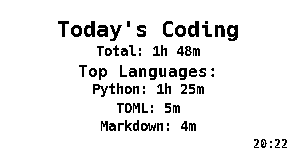
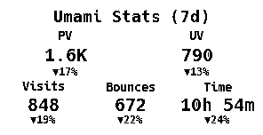
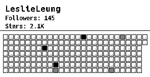
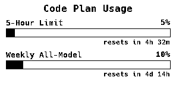

# Dotmate

Dotmate 是一个用于管理墨水屏消息推送的调度器，支持 [Quote/0](https://dot.mindreset.tech/product/quote)（296×152）与 [Zectrix Note 4](https://www.zectrix.com/note4.html)（400×300），可通过定时任务向设备发送各种类型的消息。Note 4 仅通过图片 API 推送。

## 功能特性

- 🕐 **定时任务调度**：基于 Cron 表达式的定时任务系统
- 💬 **多种消息类型**：支持文本消息、工作倒计时、代码状态、图片消息、标题图片生成和 Umami 统计等多种消息类型
- 📱 **多设备型号**：Quote/0 与 Zectrix Note 4，按设备类型自动选择分辨率与 API
- 🎯 **多设备管理**：支持管理多个设备，每个设备可配置独立的任务调度
- 🖥️ **Web 管理面板**：在浏览器中管理 API Key、设备、调度任务和远程设备设置
- 🔑 **多凭据与设备同步**：可批量绑定 MindReset/Zectrix API Key，自动导入并去重设备
- 🌐 **中英文界面**：Web UI 支持简体中文、英文和跟随系统语言
- 🔧 **灵活配置**：使用 YAML 配置文件管理设备和任务
- 🚀 **即时推送**：支持手动触发消息推送

## 效果展示

### 标题图片


### 工作倒计时


### 代码状态监控


### Umami 统计


### GitHub 贡献图


### 代码计划用量


## 快速开始

### 方式一：Docker Compose（推荐）

同一镜像支持 Web 管理面板和 YAML daemon。两种模式相互独立，Web 模式使用 SQLite，不会读取 `config.yaml`。

#### Web 管理面板

设备和调度任务保存在 SQLite 中，必须把 `data/` 目录挂载到容器内，否则重建容器后配置会丢失。

1. 克隆项目：
```bash
git clone https://github.com/leslieleung/dotmate
cd dotmate
```

2. 设置管理 Token（容器对外监听，必须设置）：
```bash
cp .env.example .env
# 编辑 .env，将 ADMIN_TOKEN 设为足够长的随机值，例如：
# openssl rand -hex 32
```

3. 启动服务：
```bash
docker compose --profile web up -d

# 查看日志
docker compose --profile web logs -f

# 停止 Web 容器（不要用 down，以免误停同项目里的 YAML daemon）
docker compose --profile web stop
```

4. 打开 http://localhost:8000 ，在「设置」页绑定 MindReset 或 Zectrix API Key 并同步设备。

SQLite 文件位于宿主机 `./data/dotmate.db`（可用 `DOTMATE_DB_PATH` 修改容器内路径，但应仍指向已挂载的 `data/` 目录）。可用 `DOTMATE_WEB_PORT` 修改宿主机端口，默认 `8000`。更新或重建容器前请备份 `data/`。若本地仍是旧镜像，先执行 `docker compose --profile web pull` 或 `docker compose --profile web build`。

#### YAML 守护进程

不需要 Web UI、只用 `config.yaml` 跑定时任务时：

1. 克隆项目后复制并编辑配置：
```bash
cp config.example.yaml config.yaml
```

2. 启动服务：
```bash
docker compose --profile daemon up -d

# 查看日志
docker compose --profile daemon logs -f

# 停止服务
docker compose --profile daemon stop
```

### 方式二：直接使用 Docker

如果你只想快速运行，可以直接使用 Docker 命令。

Web 管理面板（持久化 SQLite）：

```bash
docker pull ghcr.io/leslieleung/dotmate:latest

mkdir -p data logs
docker run -d \
  --name dotmate-web \
  --restart unless-stopped \
  -p 8000:8000 \
  -e ADMIN_TOKEN="your-long-random-token" \
  -e DOTMATE_DB_PATH=/app/data/dotmate.db \
  -v $(pwd)/data:/app/data \
  -v $(pwd)/logs:/app/logs \
  ghcr.io/leslieleung/dotmate:latest \
  .venv/bin/python main.py web --host 0.0.0.0 --port 8000
```

YAML 守护进程（需要提前准备好 `config.yaml`）：

```bash
docker run -d \
  --name dotmate \
  --restart unless-stopped \
  -v $(pwd)/config.yaml:/app/config.yaml:ro \
  -v $(pwd)/logs:/app/logs \
  ghcr.io/leslieleung/dotmate:latest

# 查看日志
docker logs -f dotmate

# 停止并删除容器
docker stop dotmate
docker rm dotmate
```

### 方式三：本地开发

#### 环境要求
- Python >= 3.12
- Node.js >= 20.19（仅构建/开发 Web UI 时需要）
- uv 包管理器（推荐）

#### 安装

```bash
# 克隆项目
git clone https://github.com/leslieleung/dotmate
cd dotmate

# 安装 Python 依赖
uv venv
uv sync

# 安装 Web UI 依赖
cd web/frontend
npm ci
cd ../..
```

#### 配置（daemon / push 模式）

1. 复制配置文件模板：
```bash
cp config.example.yaml config.yaml
```

2. 编辑配置文件 `config.yaml`，填入你的 API 密钥和设备信息。Web 模式不使用这个文件，可直接跳过此步。

#### 运行

##### 启动守护进程
```bash
# 启动定时任务调度器
python main.py daemon

# 或者直接运行（默认为守护进程模式）
python main.py
```

##### Web 管理面板

```bash
# 首次使用先安装前端依赖
cd web/frontend && npm ci && cd ../..

# 构建前端并启动生产模式服务
make web
# 打开 http://localhost:8000
```

`make web` 会先构建前端，再启动仅监听本机的 FastAPI 管理服务。首次进入「设置」页后绑定 MindReset 或 Zectrix API Key，即可同步设备；不需要先创建 `config.yaml`。

Web UI 目前支持：

- 批量绑定、重命名、同步 API Key，并按 vendor 和硬件型号校验设备
- 创建、编辑、删除设备与调度任务；任务表单会按 Quote/0 或 Note 4 的能力动态调整
- 保存任务时检查同一设备的 Cron 冲突，保存后热加载调度器，也可立即执行单个任务
- 缓存并展示支持该能力的设备状态，支持手动刷新或设置单设备轮询间隔
- 管理 MindReset 设备的时区、休眠时段和刷新间隔，切换下一条内容并查看内容列表
- 在简体中文、英文和「跟随系统」之间切换

Web 模式的配置保存在 SQLite `data/dotmate.db` 中，与 `config.yaml` 驱动的 daemon/push 模式相互独立，不会自动导入 YAML 配置。Zectrix 目前支持设备发现与图片任务；设备状态和远程设置由 MindReset API 提供。

若要允许其他主机访问，必须设置管理 Token：

```bash
export ADMIN_TOKEN="your-long-random-token"
python main.py web --host 0.0.0.0 --port 8000
```

启用 Token 后，浏览器会显示登录页，后续 API 请求通过 Bearer Token 认证。可用 `DOTMATE_DB_PATH` 指定其他 SQLite 路径。

##### 手动发送消息
```bash
# 发送文本消息
python main.py push mydevice text --message "Hello World" --title "通知" --signature "12:30"

# 发送工作倒计时（生成图片）
python main.py push mydevice work --clock-in "09:00" --clock-out "18:00"

# 发送自定义图片
python main.py push mydevice image --image-path "path/to/image.png"

# 发送标题图片（动态生成）
python main.py push mydevice title_image --main-title "主标题" --sub-title "副标题"

# 发送代码状态监控
python main.py push mydevice code_status --wakatime-url "https://waka.ameow.xyz" --wakatime-api-key "your-key" --wakatime-user-id "username"

# 发送 Umami 统计数据
python main.py push mydevice umami_stats --umami-host "https://umami.ameow.xyz" --umami-website-id "website-id" --umami-api-key "api-key" --umami-time-range "7d"

# 发送 GitHub 贡献图
python main.py push mydevice github_contributions --github-username "username" --github-token "ghp_xxxxx"

# 发送代码计划用量
python main.py push mydevice code_plan_usage --api-url "http://your-api-host:9211" --provider "anthropic" --api-username "user" --api-password "pass"
```

##### 生成 Demo 图片（不发送到设备）
demo 命令可以生成 PNG 图片并保存到本地，用于测试和预览效果，而不实际发送到设备。

```bash
# 生成标题图片
python main.py demo title_image --main-title "测试标题" --sub-title "副标题"

# 生成工作倒计时图片
python main.py demo work --clock-in "09:00" --clock-out "18:00"

# 生成代码状态监控图片
python main.py demo code_status --wakatime-url "https://waka.ameow.xyz" --wakatime-api-key "your-key" --wakatime-user-id "username"

# 生成 Umami 统计图片
python main.py demo umami_stats --umami-host "https://umami.ameow.xyz" --umami-website-id "website-id" --umami-api-key "api-key" --umami-time-range "7d"

# 生成 GitHub 贡献图
python main.py demo github_contributions --github-username "username" --github-token "ghp_xxxxx"

# 生成代码计划用量图片
python main.py demo code_plan_usage --api-url "http://your-api-host:9211" --provider "anthropic" --api-username "user" --api-password "pass"

# 指定输出目录
python main.py demo title_image --main-title "测试" --output "./my-demos"

# demo 命令支持所有与 push 命令相同的参数（除了设备名称）
# 生成的图片默认保存在 demos/ 目录下
```

## 消息类型

### 文本消息 (text)
发送自定义文本消息，支持标题、内容、签名、图标、跳转链接和多 Text API 内容选择。

支持以下参数：
- `title`: 消息标题（可选）
- `message`: 消息内容（必填，支持 `\n` 换行和 `\t` 制表符）
- `signature`: 签名（可选，默认使用当前时间）
- `icon`: 可选，PNG Base64 图标数据或可匿名访问的 http(s) 图片 URL
- `link`: 可选的跳转链接
- `task_key`: 可选，指定要更新的 Text API 内容
- `task_alias`: 可选，按别名指定要更新的 Text API 内容
- `styles`: 可选，配置文件中可传 Dot. Text API 的 `styles` 对象

### 工作倒计时 (work)
显示距离下班还有多长时间，支持自定义上班和下班时间。现在以图片形式显示，支持中文字体渲染。


### 图片消息 (image)
发送 PNG 格式的图片文件到设备。支持以下参数：
- `image_path`: 图片文件路径
- `link`: 可选的跳转链接
- `border`: 可选的边框颜色（`0` 为白色，`1` 为黑色）
- `task_key`: 可选，指定要更新的 Image API 内容
- `task_alias`: 可选，按别名指定要更新的 Image API 内容
- `dither_type`: 抖动类型，可选值：
  - `DIFFUSION`: 扩散抖动（默认）
  - `ORDERED`: 有序抖动
  - `NONE`: 不使用抖动
- `dither_kernel`: 抖动算法，可选值：
  - `FLOYD_STEINBERG`: Floyd-Steinberg 算法（经典扩散抖动）
  - `ATKINSON`: Atkinson 算法
  - `BURKES`: Burkes 算法
  - `SIERRA2`: Sierra-2 算法
  - `STUCKI`: Stucki 算法
  - `JARVIS_JUDICE_NINKE`: Jarvis-Judice-Ninke 算法
  - `THRESHOLD`: 阈值算法
  - `DIFFUSION_ROW`: 行扩散
  - `DIFFUSION_COLUMN`: 列扩散
  - `DIFFUSION2_D`: 二维扩散

### 标题图片 (title_image)
动态生成包含标题的图片消息。支持以下参数：
- `main_title`: 主标题（必填）
- `sub_title`: 副标题（可选）
- 支持中文字体渲染和自动字体大小调整
- 支持文本自动换行
- 其他图片相关参数同 image 类型


### 代码状态 (code_status)
显示来自 Wakatime API 的编程时间统计信息，以图片形式展示今日编程时间、主要编程语言、项目和类别。支持以下参数：
- `wakatime_url`: Wakatime 服务器 URL（必填）
- `wakatime_api_key`: Wakatime API 密钥（必填）
- `wakatime_user_id`: Wakatime 用户 ID（必填）
- 其他图片相关参数同 image 类型


### Umami 统计 (umami_stats)
显示来自 Umami Analytics 的网站访问统计信息，以图片形式展示页面浏览量、访客数、跳出率和平均访问时长。支持以下参数：
- `umami_host`: Umami 服务器地址（必填）
- `umami_website_id`: Umami 网站 ID（必填）
- `umami_api_key`: Umami API 密钥（必填）
- `umami_time_range`: 统计时间范围，可选值：`24h`（24小时）、`7d`（7天）、`30d`（30天）、`90d`（90天），默认为 `24h`
- 其他图片相关参数同 image 类型


### GitHub 贡献图 (github_contributions)
显示 GitHub 用户的贡献热力图，包括用户信息、followers、总 stars 和最近一个月的贡献网格图。支持以下参数：
- `github_username`: GitHub 用户名（必填）
- `github_token`: GitHub Personal Access Token（必填）
- 其他图片相关参数同 image 类型


### 代码计划用量 (code_plan_usage)

以进度条形式展示代码计划 API 的配额使用情况，支持同时显示最多 2 个配额。

数据来源为 [onWatch](https://github.com/onllm-dev/onwatch)，这是一个开源的工具，用于实时追踪 Anthropic（Claude Code）、Synthetic、Z.ai、GitHub Copilot 等多个 AI 服务的 API 配额使用情况。**使用本功能前需要自行部署并运行 onWatch**，具体部署方式请参考 [onWatch 文档](https://github.com/onllm-dev/onwatch)。

支持以下参数：
- `api_url`: onWatch 服务器地址（必填，如 `http://your-host:9211`）
- `provider`: 提供商名称，默认为 `anthropic`
- `api_username`: Basic Auth 用户名（可选）
- `api_password`: Basic Auth 密码（可选）
- 其他图片相关参数同 image 类型


## 状态叠加层（Overlay）

对于图像类型的消息，可以在右下角叠加显示设备电池状态和刷新时间。该功能在设备级别配置，对该设备下所有图像类消息生效。

```yaml
devices:
  - name: "我的设备"
    device_id: "device-001"
    show_battery_icon: true        # 显示电池图标
    show_battery_percentage: true   # 显示电量百分比（如 85%）
    show_refresh_time: true         # 显示最近刷新时间（如 17:10）
```

- 充电状态下会显示 `+` 标识
- 仅对图像类消息（work、code_status、image、title_image、umami_stats、github_contributions、code_plan_usage）生效，文本消息不受影响

## 配置说明

配置文件使用 YAML 格式，按平台（厂商）分组配置：

- `platforms`: 按厂商分组的平台配置
  - `quote0.api_key`: Quote/0 平台 API 密钥（有 quote0 设备时必填）
  - `zectrix.api_key`: Zectrix Note 4 平台 API 密钥（`zt_...`，有 zectrix 设备时必填）
- `devices`: 设备列表
  - `name`: 设备名称
  - `device_id`: 设备唯一标识符（Note 4 为 MAC 地址，如 `AA:BB:CC:DD:EE:FF`）
  - `platform`: 设备所属平台，`quote0`（默认，296×152，支持文本+图片）或 `zectrix`（400×300，仅图片）
  - `api_key`: 设备级 API 密钥覆盖（可选，覆盖 `platforms.<name>.api_key`）
  - `show_battery_icon`: 在图像右下角显示电池图标（可选，默认 `false`；Note 4 无状态接口）
  - `show_battery_percentage`: 在图像右下角显示电量百分比（可选，默认 `false`）
  - `show_refresh_time`: 在图像右下角显示刷新时间（可选，默认 `false`）
  - `schedules`: 定时任务列表
    - `cron`: Cron 表达式
    - `type`: 消息类型
    - `params`: 消息参数（可选；Note 4 可用 `page_id: "1"` 指定页面 1–5）

> 注：在仅图片平台（如 `zectrix`）上配置 `text` 任务会在加载时报错。

### Zectrix Note 4 示例

```yaml
platforms:
  zectrix:
    api_key: "zt_your_key"
devices:
  - name: "Note4"
    device_id: "AA:BB:CC:DD:EE:FF"
    platform: zectrix
    schedules:
      - cron: "*/15 * * * *"
        type: title_image
        params:
          main_title: "Hello"
          sub_title: "Note 4"
          dither_type: "NONE"
          page_id: "1"
```

本地预览 Note 4 分辨率（400×300）demo：

```bash
python main.py demo title_image --platform zectrix --main-title "测试" --sub-title "400x300"
```

### Cron 表达式示例

```bash
"*/5 * * * *"      # 每5分钟
"0 9-18 * * 1-5"   # 工作日每小时
"0 12 * * *"       # 每天中午12点
"*/30 9-17 * * 1-5" # 工作日工作时间内每30分钟
```

## 开发

如需扩展功能或贡献代码，请参考 [开发指南](DEVELOPMENT.md)。

## 贡献

欢迎提交 Pull Request 和 Issue！
